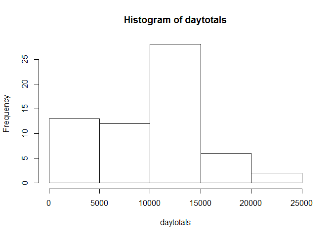
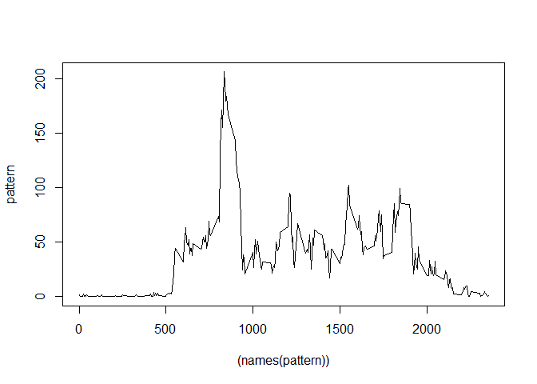
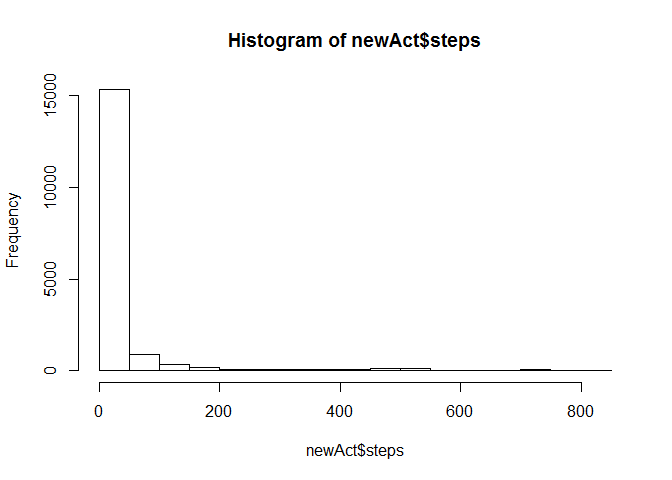

# Reproducible Research: Peer Assessment 1
Kimberley Mitchell  
April 16, 2015  


## Loading and preprocessing the data


```r
activity <- read.csv(unzip("activity.zip"),stringsAsFactors=TRUE)
activity$DATE <- as.Date(activity$date)
activity$dayofweek <- weekdays(activity$DATE)
```


## What is mean total number of steps taken per day?


```r
day <- split(activity,activity$date)
daytotals <- sapply(day, function(x){
    sum(x[,c("steps")],na.rm=TRUE)
})

hist(daytotals)
```

 

```r
summary(daytotals)[["Mean"]]
```

```
## [1] 9354
```

```r
summary(daytotals)[["Median"]]
```

```
## [1] 10400
```
The mean total number of steps per day is 9354

The median total number of steps per day is 10400


## What is the average daily activity pattern?


```r
time <- split(activity,activity$interval)
pattern <- sapply(time, function(x){
    mean(x[,c("steps")],na.rm=TRUE)
})

plot((names(pattern)),pattern,type="l")
```

 
  
The interval with the highest average number of steps is calculated below:  

```r
maxint <- pattern[pattern==max(pattern)]
names(maxint)
```

```
## [1] "835"
```

```r
maxint
```

```
##      835 
## 206.1698
```
and the interval with the highest number of steps is 835  with 206.1698113 steps on average.


## Imputing missing values

The total number of missing values are calculated below:

```r
sum(is.na(activity$steps))
```

```
## [1] 2304
```

Missing values are imputed to be 0 steps for the intervals where steps==NA (code below).  

```r
steps <- NULL
for (i in 1:length(activity$steps)) {
    steps[i] <- activity$steps[i]
    if (is.na(steps[i])) {steps[i] <- 0}
}

newAct <- cbind(steps,activity[,2:5])

hist(newAct$steps)
```

 
Mean of total steps taken per day given the imputation of 0 for NA values of steps.

```r
day <- split(newAct,newAct$date)
daytotals <- sapply(day, function(x){
    sum(x[,c("steps")],na.rm=TRUE)
})

hist(daytotals)
```

 

```r
summary(daytotals)[["Mean"]]
```

```
## [1] 9354
```

Median of total steps taken per day given the imputation of 0 for NA values of steps.

```r
summary(daytotals)[["Median"]]
```

```
## [1] 10400
```
  
Because the imputation of zero for NA values didn't change the daily totals, neither the median nor the mean of the daily totals changed. If any other (positive) values had been imputed for the NA step intervals, the mean would have been increased, and the median would likely have also been increased.
  

## Are there differences in activity patterns between weekdays and weekends?


```r
newAct$weekend <- NULL
for (i in 1:length(newAct$dayofweek)) {
    newAct$weekend[i] <- "weekday"
    if (newAct$dayofweek[i]=="Saturday"|newAct$dayofweek[i]=="Sunday")
        {
        newAct$weekend[i] <- "weekend"
        }
}
newAct$weekend <- as.factor(newAct$weekend)
```
  
